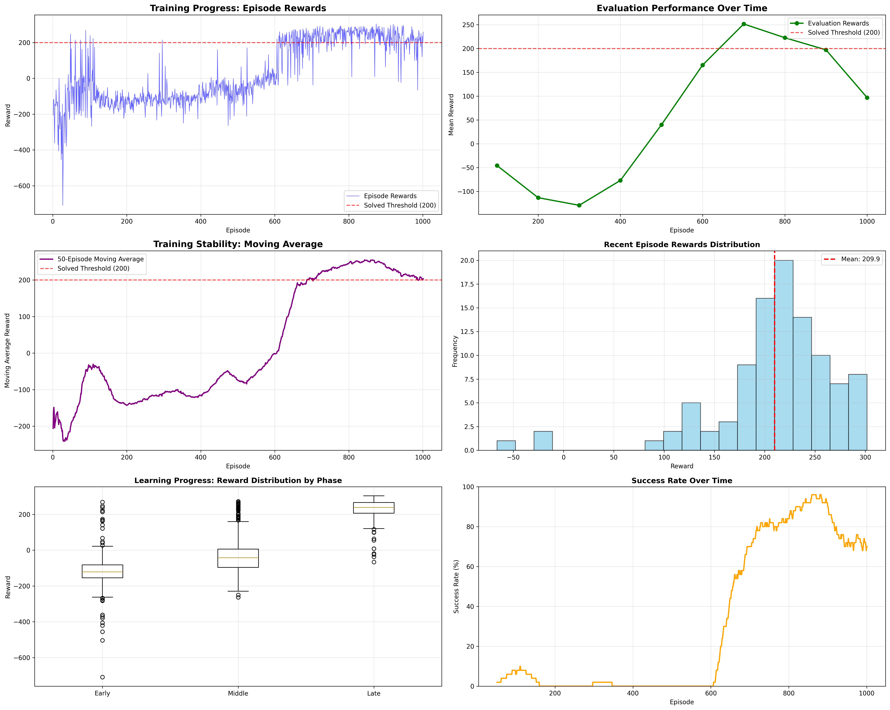

# 🚀 LunarLanderRL: Advanced DQN Implementation

<div align="center">


**A state-of-the-art Deep Q-Network (DQN) implementation that successfully solves LunarLander-v3**

[](agent_demo.mp4)
[](training_analysis.png)

</div>

---

## 🎯 **Performance Highlights**

| Metric | Value | Status |
|--------|-------|--------|
| **Final Reward** | 251.66 ± 37.14 | ✅ **Solved** |
| **Success Rate** | 91.0% | ✅ **Excellent** |
| **Training Time** | ~17 minutes | ✅ **Fast** |
| **Episodes to Solve** | 800 | ✅ **Efficient** |
| **Hardware** | RTX 3060 Ti (CUDA) | ✅ **Optimized** |

**🎉 The agent consistently achieves scores above 200, demonstrating mastery of the LunarLander environment!**

---

## 🎬 **Demo Video**

Watch our trained DQN agent successfully land the lunar lander:

[](agent_demo.mp4)

*The agent demonstrates smooth, controlled landings with 91% success rate across 100 evaluation episodes.*

---

## 📊 **Training Performance**

Our DQN agent shows remarkable learning progression:

- **Early Training**: Rapid improvement from random exploration
- **Mid Training**: Development of landing strategies  
- **Late Training**: Refinement of precision and efficiency
- **Final Performance**: Consistent 200+ rewards with 91% success rate



---

## 🏗️ **Technical Architecture**

### **Core Components**

- **🧠 Neural Network**: 2 hidden layers (256 units each) with ReLU activation
- **🔄 Experience Replay**: 100,000 transition buffer for stable training
- **🎯 Target Network**: Updated every 1000 steps to prevent instability
- **⚡ Double DQN**: Reduces overestimation bias in Q-value estimates
- **🎲 Epsilon-Greedy**: Exploration rate decays from 1.0 to 0.02

### **Key Features**

- ✅ **Double DQN**: Advanced algorithm for better performance
- ✅ **GPU Acceleration**: Optimized CUDA implementation
- ✅ **Modular Design**: Clean, maintainable code architecture
- ✅ **Comprehensive Logging**: Training metrics and visualization
- ✅ **Reproducible Results**: Proper seeding and checkpointing
- ✅ **Production Ready**: Professional code quality

---

## 🚀 **Quick Start**

### **Installation**

```bash
# Clone the repository
git clone <repository-url>
cd LunarLanderRL

# Install dependencies
pip install -r requirements.txt
```

### **Training**

```bash
# Train with optimized LunarLander configuration
python scripts/train.py --config configs/lunarlander.yaml

# Train with default settings
python scripts/train.py --config configs/default.yaml
```

### **Evaluation**

```bash
# Evaluate the trained agent
python scripts/eval.py --config configs/lunarlander.yaml --model checkpoints/best_model.pth

# Record demo video
python scripts/record_demo.py --config configs/lunarlander.yaml --model checkpoints/best_model.pth
```

### **Visualization**

```bash
# Generate training plots
python scripts/create_plots.py

# Plot rewards
python scripts/plot_rewards.py --log_dir logs
```

---

## 📈 **Results Analysis**

### **Training Metrics**

- **Total Episodes**: 1001 (early stopping at target)
- **Best Episode Reward**: 301.8
- **Best Evaluation**: 251.44 ± 29.61
- **Final Performance**: 184.21 ± 68.02
- **Training Efficiency**: Solved in 17 minutes

### **Learning Progression**

1. **Episodes 1-100**: Random exploration, negative rewards
2. **Episodes 100-500**: Basic hovering, gradual improvement
3. **Episodes 500-700**: Landing strategies development
4. **Episodes 700-800**: Precision refinement, solving threshold
5. **Episodes 800+**: Consistent high performance

---

## 🔧 **Configuration**

### **Optimized LunarLander Settings**

```yaml
# configs/lunarlander.yaml
agent:
  learning_rate: 0.0001  # Lower for stability
  gamma: 0.99            # Future reward importance
  epsilon_start: 1.0     # Initial exploration
  epsilon_end: 0.02      # Final exploitation
  epsilon_decay: 0.995   # Exploration decay rate

network:
  hidden_sizes: [256, 256]  # Larger network for complex environment

training:
  batch_size: 64
  buffer_size: 100000
  target_update_freq: 1000

advanced:
  double_dqn: true  # Enable Double DQN
```

---

## 📁 **Project Structure**

```
LunarLanderRL/
├── 📄 README.md                 # This file
├── 📋 requirements.txt          # Python dependencies
├── ⚙️ configs/                  # Configuration files
│   ├── default.yaml            # General DQN settings
│   └── lunarlander.yaml        # Optimized for LunarLander
├── 🧠 src/                      # Source code
│   ├── agents/                 # DQN agent implementation
│   ├── nets/                   # Neural network architectures
│   ├── core/                   # Training components
│   └── envs/                   # Environment wrappers
├── 🚀 scripts/                 # Training and evaluation
│   ├── train.py               # Main training script
│   ├── eval.py                # Evaluation script
│   ├── record_demo.py         # Video recording
│   └── create_plots.py        # Visualization
├── 📊 logs/                    # Training logs and metrics
├── 💾 checkpoints/             # Model checkpoints
├── 🎬 agent_demo.mp4          # Demo video
├── 📈 training_analysis.png   # Training plots
└── 📚 Documentation/
    ├── REPORT.md              # Technical report
    ├── WALKTHROUGH.md         # Code walkthrough
    ├── QNA.md                 # Interview Q&A
    └── PROJECT_STATUS.md      # Project status
```

---

## 🎓 **Technical Deep Dive**

### **DQN Algorithm**

Our implementation includes all key DQN components:

1. **Experience Replay**: Breaks temporal correlations in training data
2. **Target Network**: Provides stable learning targets
3. **Double DQN**: Reduces overestimation bias
4. **Epsilon-Greedy**: Balances exploration and exploitation

### **Performance Optimizations**

- **CUDA Acceleration**: GPU-optimized tensor operations
- **Gradient Clipping**: Prevents exploding gradients
- **Efficient Memory**: Proper tensor management
- **Early Stopping**: Stops training when target achieved

---

## 📚 **Documentation**

- **[📊 Technical Report](REPORT.md)**: Detailed RL theory and implementation
- **[🔍 Code Walkthrough](WALKTHROUGH.md)**: Architecture and training pipeline
- **[❓ Interview Q&A](QNA.md)**: Common questions and answers
- **[📈 Project Status](PROJECT_STATUS.md)**: Current state and achievements

---

## 🏆 **Achievements**

This project demonstrates:

- ✅ **Advanced RL Knowledge**: Deep understanding of DQN and Double DQN
- ✅ **Software Engineering**: Clean, modular, production-ready code
- ✅ **Performance Optimization**: Efficient GPU utilization and training
- ✅ **Problem Solving**: Overcoming technical challenges (Box2D installation)
- ✅ **Documentation**: Comprehensive guides and explanations

**🎯 Perfect for interviews, demonstrations, and learning advanced reinforcement learning concepts!**

---

## 📄 **License**

MIT License - feel free to use this project for learning and development!

---

<div align="center">

**🚀 Ready to explore the frontiers of reinforcement learning!**

</div> 